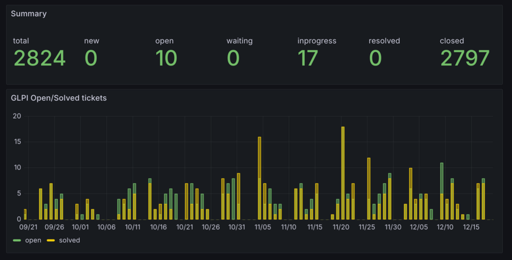

# GLPI to Grafana exporter

This script exports GLPI statistics from database into JSON format, usable with [grafana-infinity-datasource](https://github.com/grafana/grafana-infinity-datasource) plugin of [Grafana](https://grafana.com/).

Example config:
~~~
DBURL=mysql:///support
TICKETS=glpi_tickets
~~~

Use:
~~~
# make glpi.json with statistics for last year
glpi-grafana-exporter -c config.env --soft 365

# recalculate statistics for a last 3 days (for [daily] cron job)
glpi-grafana-exporter -c config.env --hard 3
~~~
